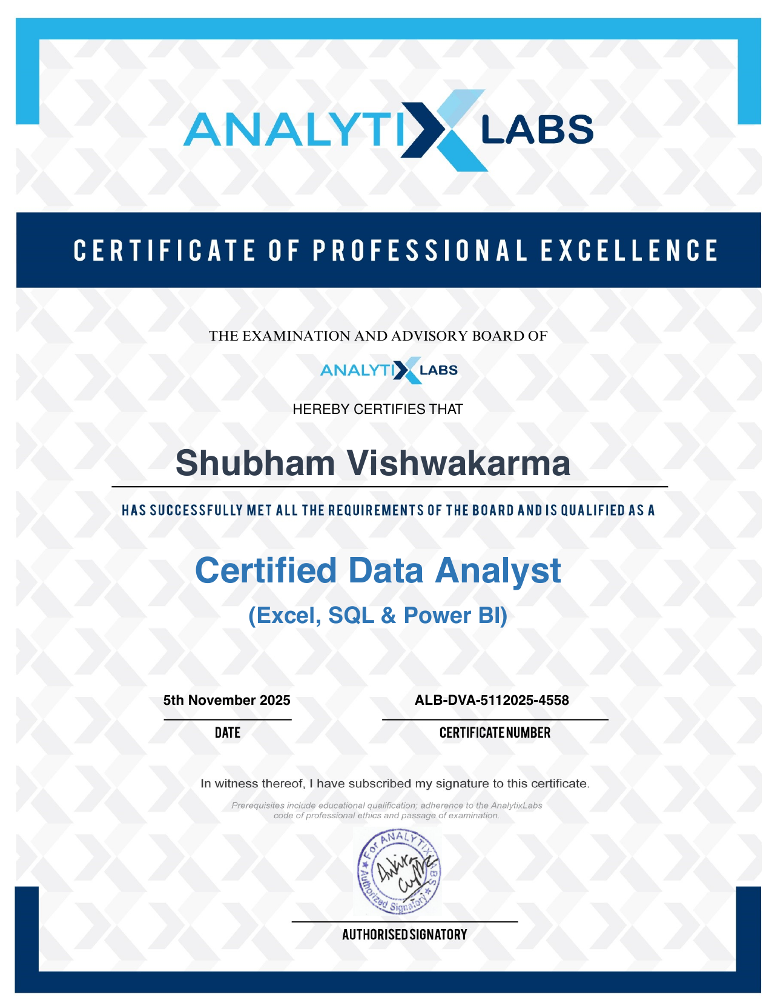
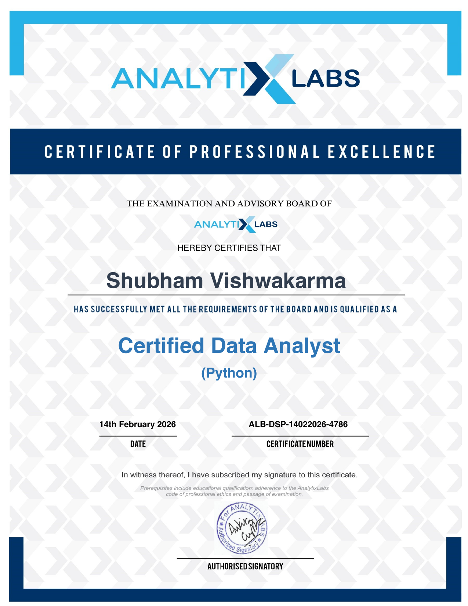
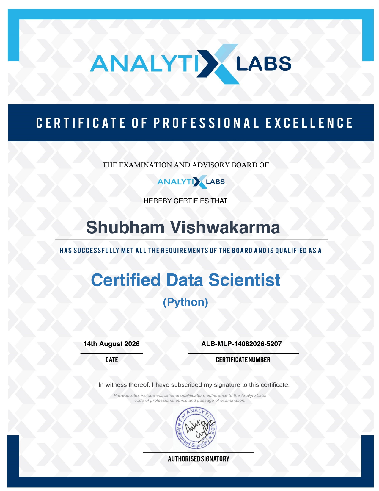
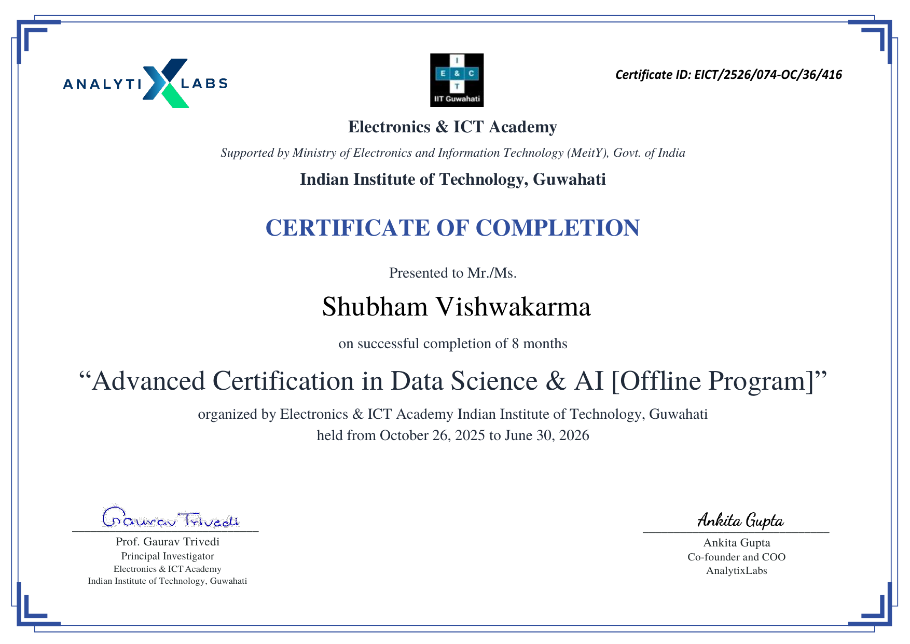

# 👋 Hi, I'm Shubham Vishwakarma

🎯 **Data Analyst | SQL | Python | Power BI | Excel | Statistics | Machine Learning | IBM Certified**

I am a B.Tech Graduate in Information Technology (2026) and an IBM Certified Data Analyst with hands-on experience in Data Analytics, Business Intelligence, Data Visualization, Statistics, and Machine Learning.

I specialize in transforming raw data into actionable business insights through data analysis, dashboard development, statistical modeling, and predictive analytics. Currently building real-world projects in SQL, Power BI, Python, and Machine Learning while sharpening my problem-solving skills through daily coding and analytics challenges.

📫 **Open to:** Data Analyst · Junior Data Analyst · Business Intelligence Analyst · Reporting Analyst · MIS Analyst

---

## 🎯 Portfolio Highlights

- ✔️ 13+ Data Analytics & Machine Learning Projects
- ✔️ IBM Certified Data Analyst & Data Scientist
- ✔️ AnalytixLabs Certified Data Analyst (Python) & (Excel, SQL & Power BI)
- ✔️ AnalytixLabs Certified Data Scientist (Python)
- ✔️ IIT Guwahati (E&ICT Academy) — 8-Month Advanced Certification in Data Science & AI
- ✔️ Microsoft SQL Server Professional Certificate
- ✔️ 174 SQL problems solved on LeetCode — **Top SQL 50** badge
- ✔️ 100 Days Machine Learning Challenge
- ✔️ End-to-End Dashboard Development (Power BI, Excel)

---

## 🧰 Skills & Tools

### 📊 Data Analytics
Data Cleaning · Exploratory Data Analysis (EDA) · Data Visualization · Statistical Analysis · Business Intelligence · KPI Reporting & Insights

### 💻 SQL
Joins & Subqueries · CTEs · Window Functions · Stored Procedures · Query Optimization

### 🐍 Python
Pandas · NumPy · Matplotlib · Seaborn · Scikit-Learn

### 📈 Power BI
DAX · Power Query · Data Modeling · Dashboard Development

### 📗 Excel
Pivot Tables · Power Query · Dashboards · Advanced Formulas

### 🤖 Machine Learning
Regression · Classification · Feature Engineering · Model Evaluation · Predictive Analytics

### 🛠 Tools & Platforms
Git · GitHub · Jupyter Notebook

---

## 📂 Featured Projects

### 🔹 SQL Projects
- 📈 **[Superstore Sales Analysis (SQL)](https://github.com/shubham-vishwakarma-analytics/Superstore-Sales-Analysis---SQL)**
- 📊 **[MovieLens SQL Case Study](https://github.com/shubham-vishwakarma-analytics/MovieLens-SQL-CaseStudy)**
- 📉 **[Customer Orders Analysis (SQL)](https://github.com/shubham-vishwakarma-analytics/Customer-Orders-Analysis---SQL)**

### 🔹 Power BI Projects
- 📊 **[Superstore Sales Analysis Dashboard](https://github.com/shubham-vishwakarma-analytics/Superstore-Sales-Analysis-Dashboard---PowerBI)**
- 📈 **[Adventure Works Sales Analysis Dashboard](https://github.com/shubham-vishwakarma-analytics/Adventure-Works-Sales-Analysis-Dashboards---PowerBI)**
- 📉 **[Amazon Global Superstore Sales Dashboard](https://github.com/shubham-vishwakarma-analytics/Amazon-Global-Superstore-Sales-Dashboard---PowerBI)**

### 🔹 Excel Projects
- ☕ **[Coffee Shop Sales Analysis Dashboard](https://github.com/shubham-vishwakarma-analytics/Coffee-Shop-Sales--Excel)**
- 📊 **[Superstore Sales Analysis Dashboard (Excel)](https://github.com/shubham-vishwakarma-analytics/Superstore-Sales-Analysis-Dashboard---Excel)**
- 📦 **[Purchase & Shipping Products Analysis Dashboard](https://github.com/shubham-vishwakarma-analytics/Purchase-Shipping-Products-Analysis-Dashboard---Excel)**

### 🔹 Python Projects
- 📈 **[Retail Customer Analysis Case Study](https://github.com/shubham-vishwakarma-analytics/Retail-Customer-Analysis-Python-Case-Study-----Python)**
- 💳 **[Credit Card Data Analysis Case Study](https://github.com/shubham-vishwakarma-analytics/Credit-Card-Data-Analysis-Python-Case-Study-----Python)**

### 🔹 Machine Learning Projects
- 🤖 **[Credit Card Consumption Prediction](https://github.com/shubham-vishwakarma-analytics/Credit-Card-Consumption-Prediction)**

---

## 🚀 Learning & Challenge Repositories

| Journey | Repository |
|---|---|
| 🏆 SQL Practice | **[Daily SQL Challenges](https://github.com/shubham-vishwakarma-analytics/Daily-SQL-Challenges)** |
| 🤖 Machine Learning | **[ML 100 Days Challenge](https://github.com/shubham-vishwakarma-analytics/ML-100-Days-Challenge)** |
| 📗 Excel Practice | **[Microsoft Excel 100 Days Challenge](https://github.com/shubham-vishwakarma-analytics/Microsoft-Excel-100-Days-Challenge)** |

---

## 🏅 Certifications

<table>
<tr>
<td width="25%" align="center">
 
<b>Certified Data Analyst</b> (Excel, SQL & Power BI) AnalytixLabs · Nov 2025
</td>
<td width="25%" align="center">
 
<b>Certified Data Analyst</b> (Python) AnalytixLabs · Feb 2026
</td>
<td width="25%" align="center">
 
<b>Certified Data Scientist</b> (Python) AnalytixLabs · Aug 2026
</td>
<td width="25%" align="center">
 
<b>Advanced Certification in Data Science & AI</b> (8 months) IIT Guwahati (E&ICT Academy)
</td>
</tr>
</table>

*Click any certificate to view the full-size image.*

| Certificate | Issuer | Date | Credential ID |
|---|---|---|---|
| [IBM Data Analyst Professional Certificate](https://www.coursera.org/account/accomplishments/professional-cert/OBFJD9DQLZRF) | IBM (Coursera) | — | OBFJD9DQLZRF |
| [IBM Data Science Professional Certificate](https://www.coursera.org/account/accomplishments/professional-cert/J8BXGA7T30DQ) | IBM (Coursera) | — | J8BXGA7T30DQ |
| [Microsoft SQL Server Professional Certificate](https://www.coursera.org/account/accomplishments/professional-cert/EQRT2MQFORL1) | Microsoft (Coursera) | — | EQRT2MQFORL1 |
| Certified Data Analyst (Excel, SQL & Power BI) | AnalytixLabs | 5 Nov 2025 | ALB-DVA-5112025-4558 |
| Certified Data Analyst (Python) | AnalytixLabs | 14 Feb 2026 | ALB-DSP-14022026-4786 |
| Certified Data Scientist (Python) | AnalytixLabs | 14 Aug 2026 | ALB-MLP-14082026-5207 |
| Advanced Certification in Data Science & AI (Offline, 8 months) | IIT Guwahati — E&ICT Academy (MeitY, Govt. of India) | Oct 2025 – Jun 2026 | EICT/2526/074-OC/36/416 |
| [NASSCOM Data Visualization & Analytics](https://fsp-assessment-certificates.s3.ap-southeast-1.amazonaws.com/%27/s3/buckets/fsp-assessment-certificates%27/Shubham%2BVishwakarma_153347609.pdf.pdf) | NASSCOM FutureSkills Prime | — | — |

---

## 💻 Coding Profiles

- 🟨 **[LeetCode](https://leetcode.com/u/shubham-vishwakarma-analytics)** — 174 SQL problems solved · Top SQL 50 badge
- ⭐ **[HackerRank](https://www.hackerrank.com/profile/shubhamdata)** — Python & SQL badges
- 📊 **[StrataScratch](https://platform.stratascratch.com/user/shubhamvishwakarmaanalytics)**
- 🏆 **[Kaggle](https://www.kaggle.com/datadrivenshubham)**

---

## 📫 Connect With Me

- 💼 **LinkedIn**: [linkedin.com/in/shubham-vishwakarma-analytics](https://www.linkedin.com/in/shubham-vishwakarma-analytics)
- 💻 **GitHub**: [github.com/shubham-vishwakarma-analytics](https://github.com/shubham-vishwakarma-analytics)

---

⭐ Open to opportunities in **Data Analytics, Business Intelligence, SQL Development, Power BI, Python, and Machine Learning**.
